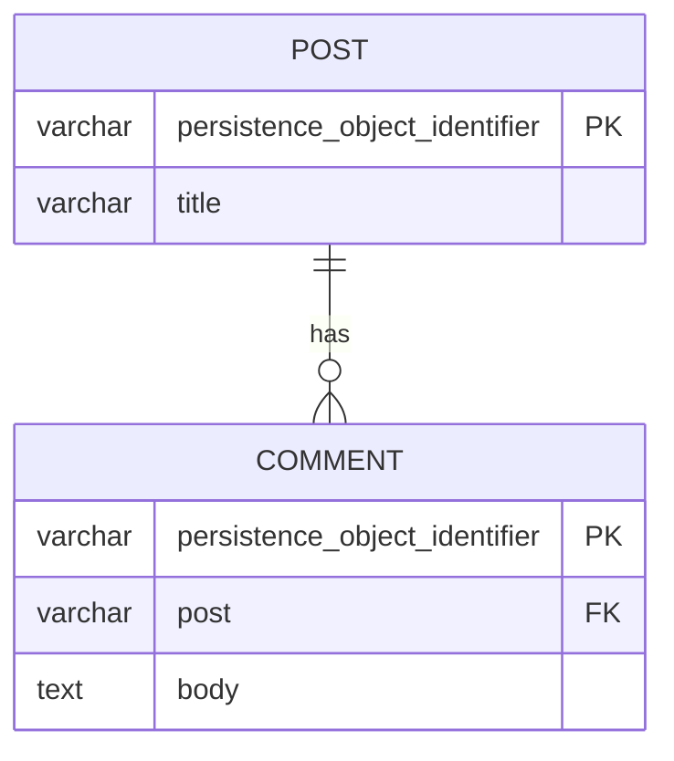

# 02 — ManyToOne một chiều (Comment → Post)

## Mục tiêu

Mapping quan hệ N-1 đơn giản nhất: nhiều `Comment` thuộc về một `Post`,
`Post` KHÔNG biết gì về các `Comment` của nó (một chiều).

## Lý thuyết



Bảng kết quả (đã generate + migrate thật):

| Bảng | Cột | Ghi chú |
|---|---|---|
| `lesson02_post` | `persistence_object_identifier` (PK), `title` | Không có gì tham chiếu tới Comment |
| `lesson02_comment` | `persistence_object_identifier` (PK), `post` (FK → lesson02_post), `body` | FK nằm ở đây |

## Owning side vs Inverse side

Với ManyToOne, **luôn chỉ có một chiều** — `Comment` là bên owning (có cột
`post` = FK trong DB). Không có "inverse side" ở bài này vì `Post` không khai
báo property nào trỏ ngược lại. Nếu bạn quên khai báo `nullable: false`, một
`Comment` "mồ côi" (không có Post) vẫn insert được vào DB — thường là bug.

## Cách Flow làm khác Laravel/Eloquent

Laravel: `Comment::create(['post_id' => $post->id, ...])` ghi ngay. Flow:
`Comment` không có setter cho khóa ngoại thô — bạn gán trực tiếp object
`Post` vào property `$post` (type-hint là `Post`, không phải `string $postId`).
Doctrine tự lấy `persistence_object_identifier` của `$post` để ghi vào cột
`post`. Không có `$post->comments()->save()` kiểu Eloquent — ở bài này `Post`
thậm chí không có property `$comments`.

## Ví dụ chạy được

Đã chạy `doctrine:validate`, `doctrine:migrationgenerate`,
`doctrine:migrate` thật với entity hoàn chỉnh, migration sinh ra đúng SQL ở
trên. Cấu trúc entity (dùng để đối chiếu, không phải để chép — starter code
của bạn để trống phần TODO):

```php
#[Flow\Entity]
#[ORM\Table(name: 'lesson02_comment')]
class Comment
{
    #[ORM\Column(type: 'text')]
    protected string $body;

    #[ORM\ManyToOne(targetEntity: Post::class)]
    #[ORM\JoinColumn(name: 'post', referencedColumnName: 'persistence_object_identifier', nullable: false)]
    protected Post $post;
    // ...
}
```

`CommentRepository` và `PostRepository` đều tồn tại (cả hai là aggregate
root) — `Comment` KHÔNG được Flow tự cascade từ `Post` vì nó có Repository
riêng (khác hẳn bài 03).

## Bẫy thường gặp

1. Quên `nullable: false` → insert Comment không có Post vẫn thành công.
2. Đặt `referencedColumnName` sai (ví dụ trỏ tới cột không phải PK) →
   `doctrine:validate` báo lỗi mapping rõ ràng.
3. Type-hint property là `int`/`string` cho khóa ngoại thay vì type là chính
   class `Post` → Flow không hiểu là quan hệ, báo lỗi "has a non standard data
   type and doesn't define the type of the relation" (đã thấy lỗi này thật khi
   thử bỏ annotation).
4. Tưởng cần gọi `$postRepository->update($post)` để lưu Comment mới — sai,
   phải `$commentRepository->add($comment)` vì Comment là aggregate root
   riêng ở bài này.

## Bài tập

- **Cơ bản**: mở
  `Classes/Domain/Model/Lesson02/Comment.php`, điền `// TODO` để mapping
  `$post` đúng như lý thuyết trên (ManyToOne, NOT NULL, join column `post`).
- **Nâng cao**: mở `Classes/Domain/Repository/Lesson02/CommentRepository.php`,
  implement `findByPost(Post $post): array` bằng `$this->createQuery()` (Flow
  `QueryInterface`), KHÔNG viết SQL thô.
- **Thử thách**: Nếu một `Post` bị xóa khỏi DB (qua `$postRepository->remove()`)
  mà vẫn còn `Comment` trỏ tới nó, chuyện gì xảy ra? Viết thử để quan sát lỗi
  FK constraint thật (MySQL sẽ chặn vì chưa có `onDelete`), rồi giải thích tại
  sao đây là hành vi ĐÚNG cho quan hệ một chiều kiểu này (khác bài 08, nơi ta
  chủ động dùng `onDelete: 'CASCADE'`).

## Cách tự kiểm tra

```bash
./flow doctrine:validate
./flow doctrine:migrationgenerate   # chọn [MKintai.DoctrineLab] khi được hỏi
./flow doctrine:migrate
```

Đối chiếu schema thật:
```sql
SHOW CREATE TABLE lesson02_comment;
-- phải thấy: post VARCHAR(40) NOT NULL, FOREIGN KEY (post) REFERENCES lesson02_post (...)
```

## Quiz

1. Vì sao `Post` không cần biết gì về `Comment` trong quan hệ một chiều? Khi
   nào thiết kế này hợp lý, khi nào không?
2. Vì sao cột FK luôn nằm ở bảng `lesson02_comment` chứ không phải
   `lesson02_post`, dù bạn có thể viết code theo hướng ngược lại?
3. Vì sao `Comment` cần Repository riêng ở bài này (khác bài 03)? Hậu quả nếu
   bạn xóa `CommentRepository` đi mà giữ nguyên mapping?

Đáp án: `solutions/02-many-to-one.md`.
