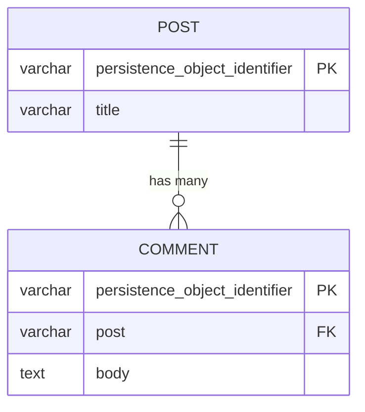

# 03 — OneToMany hai chiều (Post ↔ Comment)

## Mục tiêu

Mapping quan hệ 1-N hai chiều: `Post` có collection `$comments`, `Comment` có
property `$post` — và hiểu **hệ quả cascade tự động** khi `Comment` không có
Repository riêng.

## Lý thuyết



Schema SQL giống bài 02 về hình dạng (`lesson03_post`, `lesson03_comment`,
FK `post` trên `lesson03_comment`) — khác biệt nằm ở PHP mapping và cascade,
không nằm ở DDL.

## Owning side vs Inverse side

- **Owning side = `Comment::$post`** (`#[ORM\ManyToOne(inversedBy: 'comments')]`)
  — đây là bên có cột FK, Doctrine CHỈ đọc bên này để quyết định ghi gì.
- **Inverse side = `Post::$comments`** (`#[ORM\OneToMany(mappedBy: 'post')]`)
  — chỉ để đọc/duyệt trong PHP, Doctrine **không** dùng nó để quyết định SQL.

**Hậu quả nếu quên đồng bộ hai phía**: nếu bạn chỉ làm
`$post->getComments()->add($comment)` mà quên gọi `$comment->setPost($post)`,
Doctrine sẽ KHÔNG ghi FK (vì nó đọc owning side, tức `$comment->post`, mà
property đó vẫn null/trỏ post khác) → Comment bị lưu sai Post hoặc lỗi NOT
NULL. Đây là lý do `addComment()` phải luôn set cả hai phía.

## Cách Flow làm khác Laravel/Eloquent

Đây là điểm khác biệt lớn nhất trong module này, **đã kiểm chứng bằng cách
chạy thật**: trong Flow, nếu entity con (`Comment`) **không có Repository
riêng**, nó không phải "aggregate root", và `Neos.Flow/Classes/Persistence/
Doctrine/Mapping/Driver/FlowAnnotationDriver.php` (dòng 614-628) tự động áp:

```php
$mapping['cascade'] = ['all'];        // vì isAggregateRoot() === false
$mapping['orphanRemoval'] = true;     // ép cứng, không cho override
```

Đã chạy thử thật (tạo `Post`, `addComment()`, CHỈ gọi
`$postRepository->add($post)` — không đụng vào Comment):

```
lesson03_comment row count after persisting only Post: 1
```

Comment tự được insert — không cần `$commentRepository->add()`. Và khi gọi
`$post->removeComment($comment)` rồi `persistAll()`, row Comment biến mất
khỏi DB (orphanRemoval hoạt động thật, không chỉ là "không còn liên kết").
**Laravel không có cơ chế này** — bạn phải tự gọi `$comment->save()`/
`$comment->delete()` hoặc định nghĩa quan hệ `cascade` tường minh.

## Ví dụ chạy được

```php
// Post.php — inverse side
#[ORM\OneToMany(mappedBy: 'post', targetEntity: Comment::class)]
protected Collection $comments;

public function addComment(Comment $comment): void
{
    if ($this->comments->contains($comment)) return;
    $this->comments->add($comment);
    $comment->setPost($this);   // <-- đồng bộ owning side, bắt buộc
}
```

```php
// Comment.php — owning side
#[ORM\ManyToOne(targetEntity: Post::class, inversedBy: 'comments')]
#[ORM\JoinColumn(name: 'post', referencedColumnName: 'persistence_object_identifier', nullable: false)]
protected Post $post;
```

Không có `CommentRepository` trong package — cố ý, để kích hoạt auto-cascade
trên.

## Bẫy thường gặp

1. Quên `new ArrayCollection()` trong constructor của `Post` → gọi
   `$post->getComments()` trước khi Doctrine hydrate xong sẽ lỗi
   "Typed property must not be accessed before initialization".
2. `addComment()` chỉ add vào collection, quên `$comment->setPost($this)` →
   Comment lưu sai Post hoặc NOT NULL constraint fail.
3. Tưởng phải tự thêm `cascade`/`orphanRemoval` — không cần khi Comment không
   có Repository, Flow tự làm (và bạn KHÔNG tắt được `orphanRemoval` trong
   trường hợp này — xem bài 08 để so sánh với `InvoiceLine` có Repository).
4. `removeComment()` chỉ `removeElement()` khỏi collection mà không hiểu
   rằng orphanRemoval sẽ XÓA row thật khi `persistAll()` chạy — dễ mất dữ liệu
   nếu tưởng đây chỉ là "gỡ liên kết".
5. N+1 khi load nhiều Post rồi loop qua `getComments()` — xem bài 10.

## Bài tập

- **Cơ bản**: điền TODO mapping ở cả `Post::$comments` (OneToMany,
  `mappedBy: 'post'`) và `Comment::$post` (ManyToOne, `inversedBy: 'comments'`).
- **Nâng cao**: implement `Post::addComment()` và `Post::removeComment()` giữ
  nhất quán hai phía, idempotent (add cùng Comment 2 lần không tạo trùng).
- **Thử thách**: viết một đoạn code tạo `Post`, `addComment()`, chỉ
  `persistAll()`, rồi query trực tiếp `SELECT COUNT(*) FROM lesson03_comment`
  bằng `./flow doctrine:dql` hoặc kết nối MySQL — chứng minh Comment được
  insert dù bạn chưa từng gọi bất kỳ Repository nào của nó.

## Cách tự kiểm tra

```bash
./flow doctrine:validate
./flow doctrine:migrationgenerate && ./flow doctrine:migrate
```
```sql
SELECT COUNT(*) FROM lesson03_comment;   -- đối chiếu sau khi add/remove
```

## Quiz

1. Vì sao Doctrine chỉ đọc owning side để quyết định SQL, dù bạn có thể "thấy"
   quan hệ từ cả hai phía trong PHP?
2. Điều gì xảy ra nếu bạn xóa `CommentRepository` (đã không có) nhưng thêm
   lại nó vào package? Cascade/orphanRemoval mặc định có còn áp dụng không?
   Vì sao (liên hệ `isAggregateRoot()`)?
3. Vì sao `orphanRemoval=true` "ép cứng" bởi Flow khi Comment không có
   Repository lại nguy hiểm nếu bạn dùng Comment như một entity độc lập ở nơi
   khác trong hệ thống?

Đáp án: `solutions/03-one-to-many.md`.
