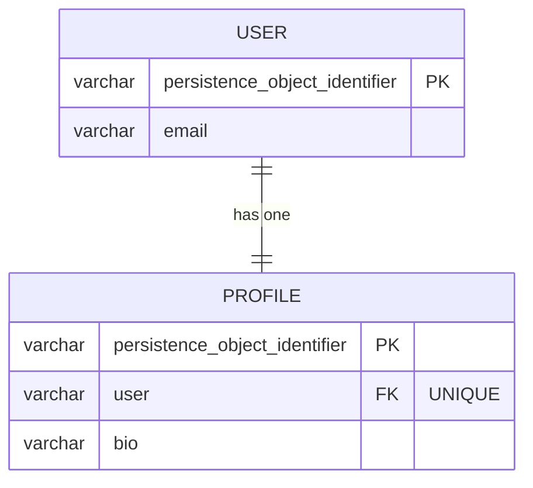

# 04 — OneToOne (User ↔ Profile)

## Mục tiêu

Mapping quan hệ 1-1: một chiều, hai chiều, và hiểu vì sao pattern "khóa
chính chung" (shared primary key) kinh điển của Doctrine **không áp dụng
thẳng được** trong Flow.

## Lý thuyết



Schema thật (đã generate + migrate):

| Bảng | Cột | Ghi chú |
|---|---|---|
| `lesson04_user` | PK, `email` (UNIQUE) | Không có FK |
| `lesson04_profile` | PK, `user` (FK UNIQUE → lesson04_user), `bio` | FK ở đây, UNIQUE để đảm bảo 1-1 thật (không phải 1-N) |

## Owning side vs Inverse side

- **Owning side = `Profile::$user`**: có `#[ORM\JoinColumn(unique: true)]`.
  Chính cột `UNIQUE` này là thứ khiến quan hệ là 1-1 thay vì 1-N — nếu bỏ
  `unique: true`, về DDL nó giống `ManyToOne` bình thường (nhiều Profile trỏ
  1 User vẫn hợp lệ với DB, chỉ có ORM tưởng là 1-1).
- **Inverse side = `User::$profile`**: `#[ORM\OneToOne(mappedBy: 'user')]`,
  chỉ đọc, không quyết định SQL.

Hậu quả quên đồng bộ: gọi `$profile = new Profile($bio, $user)` mà quên
`$user->setProfile($profile)` → `$user->getProfile()` trả `null` dù DB đã có
Profile — bug điển hình khi load lại object trong cùng request (trước khi
Doctrine flush/refresh).

## Cách Flow làm khác Laravel/Eloquent — và khác cả Doctrine thuần

1. **Laravel**: `$user->profile` là lazy-loaded qua relationship method,
   không có ORM object identity riêng biệt.
2. **Doctrine thuần** (ngoài Flow) hỗ trợ pattern "shared primary key" — con
   dùng CHÍNH giá trị PK của cha (`@ORM\Id` + `@ORM\OneToOne` trên cùng
   property). **Đã kiểm tra source thật**: `Neos.Flow/Classes/Persistence/
   Aspect/PersistenceMagicAspect.php` có pointcut
   `classAnnotatedWith(Flow\Entity) || classAnnotatedWith(Doctrine\ORM\Mapping\Entity)`
   — nghĩa là **MỌI** class được nhận diện là entity (dù dùng attribute Flow
   hay Doctrine thuần) đều bị AOP gắn thêm `persistence_object_identifier`
   riêng của nó. Flow không có cách khai báo "class này không có identity
   riêng, dùng chung với class khác" — nên pattern shared-PK kinh điển
   **không áp dụng được nguyên bản trong Flow**.
   Tương đương Flow-idiomatic của "1-1 cùng identity" là OneToOne + JoinColumn
   `unique: true, nullable: false` như trên — ràng buộc ở tầng DB thay vì
   chia sẻ PK.

## Ví dụ chạy được

```php
// Profile.php — owning side
#[ORM\OneToOne(targetEntity: User::class, inversedBy: 'profile')]
#[ORM\JoinColumn(name: 'user', referencedColumnName: 'persistence_object_identifier', nullable: false, unique: true)]
protected User $user;
```

```php
// User.php — inverse side
#[ORM\OneToOne(mappedBy: 'user', targetEntity: Profile::class)]
protected ?Profile $profile = null;
```

**Biến thể một chiều**: nếu bỏ hẳn property `$profile` + attribute trên
`User`, quan hệ vẫn hoạt động (Profile vẫn biết User của nó), chỉ mất khả
năng `$user->getProfile()`. Đây chính là sự khác biệt duy nhất giữa một
chiều và hai chiều ở OneToOne — không cần entity/cột khác.

`Profile` không có Repository riêng (giống Comment ở bài 03) → Flow tự
cascade persist/remove + orphanRemoval khi thao tác qua `User`.

## Bẫy thường gặp

1. Quên `unique: true` trên JoinColumn → DB cho phép nhiều Profile trỏ 1
   User, phá vỡ ngữ nghĩa 1-1 (dù PHP code "tưởng" là 1-1).
2. Cố gắng làm shared-PK kiểu Doctrine thuần trong Flow (`@ORM\Id` trên
   property quan hệ) — sẽ đụng cột `persistence_object_identifier` do AOP tự
   thêm, gây nhầm lẫn 2 PK.
3. `$user->getProfile()` trả null ngay sau khi `new Profile(..., $user)`
   nếu quên gọi `$user->setProfile($profile)` — lỗi đồng bộ 2 phía.
4. Nullable sai chiều: `User::$profile` nên nullable (không phải ai cũng có
   Profile), nhưng `Profile::$user` không nullable (Profile luôn thuộc 1
   User cụ thể).

## Bài tập

- **Cơ bản**: điền TODO mapping ở cả `User::$profile` (OneToOne, mappedBy) và
  `Profile::$user` (OneToOne, inversedBy, JoinColumn unique+NOT NULL).
- **Nâng cao**: thêm static factory `User::createWithProfile(string $email,
  string $bio): self` tạo cả hai entity và tự đồng bộ 2 phía, tránh phải nhớ
  gọi `setProfile()` ở nơi gọi.
- **Thử thách**: thử bỏ `unique: true` khỏi JoinColumn, migrate lại, rồi cố
  tình tạo 2 `Profile` cho cùng 1 `User`. DB có chặn không? Giải thích tại
  sao ORM-level "1-1 trong đầu bạn" và DB-level constraint là hai thứ khác
  nhau.

## Cách tự kiểm tra

```bash
./flow doctrine:validate
./flow doctrine:migrationgenerate && ./flow doctrine:migrate
```
```sql
SHOW CREATE TABLE lesson04_profile;
-- phải thấy: UNIQUE INDEX ... (user), FOREIGN KEY (user) REFERENCES lesson04_user (...)
```

## Quiz

1. Vì sao pattern "shared primary key" của Doctrine thuần không dùng được
   nguyên bản trong Flow? Liên hệ `PersistenceMagicAspect`.
2. `unique: true` trên JoinColumn giải quyết vấn đề gì mà chỉ dùng
   `ManyToOne` bình thường không giải quyết được?
3. Nếu bạn xóa property `$profile` khỏi `User` (chuyển về một chiều), có cần
   sửa gì ở `Profile` không? Vì sao?

Đáp án: `solutions/04-one-to-one.md`.
