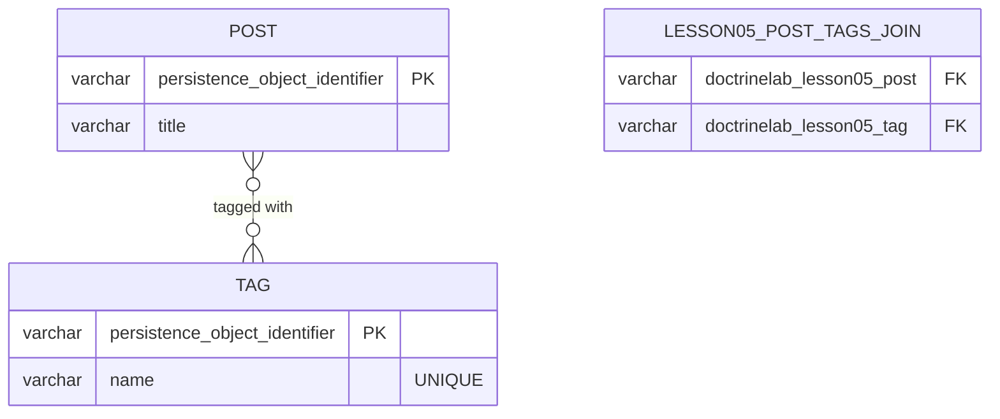

# 05 — ManyToMany (Post ↔ Tag)

## Mục tiêu

Mapping quan hệ N-N với join table tự sinh bởi Doctrine, hiểu owning/inverse
trong ManyToMany (khác OneToMany), và vì sao join entity KHÔNG tự cascade dù
không có Repository (khác bài 03).

## Lý thuyết



Schema thật (đã generate + migrate):

| Bảng | Cột | Ghi chú |
|---|---|---|
| `lesson05_post` | PK, `title` | |
| `lesson05_tag` | PK, `name` (UNIQUE) | |
| `lesson05_post_tags_join` | `doctrinelab_lesson05_post` (FK), `doctrinelab_lesson05_tag` (FK), PK kép trên cả 2 cột | Join table, tự sinh tên cột theo class (namespace + short name, không do bạn đặt) |

## Owning side vs Inverse side

- **Owning side = `Post::$tags`**: có `#[ORM\JoinTable]`, Doctrine đọc bên
  này để biết join table tên gì, cột nào join cột nào.
- **Inverse side = `Tag::$posts`**: `#[ORM\ManyToMany(mappedBy: 'tags')]`,
  chỉ đọc.

**Hậu quả quên đồng bộ**: `$post->getTags()->add($tag)` mà quên
`$tag->addPost($post)` — vẫn ghi đúng join table (vì Doctrine đọc owning
side `Post::$tags`), NHƯNG nếu trong cùng request bạn gọi
`$tag->getPosts()`, nó sẽ KHÔNG thấy `$post` vừa thêm (object trong memory
chưa đồng bộ, dù DB đã đúng) — bug khó phát hiện vì DB "trông đúng" nhưng
logic PHP sai.

## Cách Flow làm khác Laravel/Eloquent

Laravel: `$post->tags()->attach($tag->id)` ghi thẳng join table bằng ID.
Flow: bạn KHÔNG bao giờ chạm ID thô — `addTag(Tag $tag)` nhận cả object.
Khác biệt sâu hơn: cả `Post` VÀ `Tag` đều có Repository riêng (đều là
aggregate root) trong bài này — vì thế, KHÁC với `Comment` ở bài 03, Flow
**không** tự cascade persist một `Tag` mới khi bạn `$post->addTag($newTag)`
rồi chỉ `$postRepository->add($post)`. Bạn phải tự
`$tagRepository->add($newTag)` — đúng với thực tế nghiệp vụ: Tag thường là
dữ liệu **chia sẻ**, không thuộc riêng một Post nào để tự động tạo/xóa theo.

## Ví dụ chạy được

```php
// Post.php — owning side
#[ORM\ManyToMany(targetEntity: Tag::class, inversedBy: 'posts')]
#[ORM\JoinTable(name: 'lesson05_post_tags_join')]
protected Collection $tags;

public function addTag(Tag $tag): void
{
    if ($this->tags->contains($tag)) return;
    $this->tags->add($tag);
    $tag->addPost($this);   // đồng bộ phía inverse trong PHP (Tag không owning nên không ảnh hưởng SQL, nhưng cần cho tính đúng của object graph)
}
```

```php
// Tag.php — inverse side
#[ORM\ManyToMany(targetEntity: Post::class, mappedBy: 'tags')]
protected Collection $posts;
```

## Bẫy thường gặp

1. Chỉ update một phía trong PHP, tưởng đủ vì "Doctrine sẽ tự hiểu" — sai,
   object graph trong memory bị lệch dù DB đúng (xem phần "Owning/Inverse"
   trên).
2. Thêm `Tag` mới rồi quên `$tagRepository->add()` — khác bài 03, ở đây
   KHÔNG có auto-cascade vì `Tag` có Repository riêng; Doctrine sẽ báo lỗi
   "A new entity was found through the relationship... that was not
   configured to cascade persist" khi `persistAll()`.
3. Không kiểm tra `contains()` trước khi `add()` → thêm trùng Tag vào
   collection (Doctrine dedup theo identity nhưng vẫn nên tự kiểm tra để rõ
   ý định code).
4. Tên cột join table do Doctrine tự sinh (`doctrinelab_lesson05_post`,
   `doctrinelab_lesson05_tag`) đôi khi dài/khó đọc — có thể ghi đè bằng
   `joinColumns`/`inverseJoinColumns` tường minh trong `JoinTable` (xem bài
   07, chỗ self-referencing ManyToMany buộc phải làm vậy).

## Bài tập

- **Cơ bản**: điền TODO ở `Post::$tags` (ManyToMany, inversedBy, JoinTable)
  và `Tag::$posts` (ManyToMany, mappedBy).
- **Nâng cao**: implement `addTag()`/`removeTag()` giữ nhất quán 2 phía,
  idempotent.
- **Thử thách**: viết `TagRepository::findOrCreateByName(string $name):
  Tag` — tìm Tag theo tên, nếu chưa có thì tạo mới VÀ tự
  `$this->add($tag)` (persist ngay trong Repository, một pattern hợp lệ
  trong Flow vì Repository luôn có quyền persist entity của chính nó).

## Cách tự kiểm tra

```bash
./flow doctrine:validate
./flow doctrine:migrationgenerate && ./flow doctrine:migrate
```
```sql
SELECT * FROM lesson05_post_tags_join;   -- đối chiếu sau khi addTag()
```

## Quiz

1. Vì sao object graph trong PHP có thể "sai" (thiếu 1 chiều) ngay cả khi DB
   đã đúng? Khi nào bug này biểu hiện ra ngoài?
2. Vì sao `Tag` không được Flow tự cascade persist như `Comment` ở bài 03?
   Yếu tố nào trong source code quyết định điều này?
3. Nếu bỏ `#[ORM\JoinTable(name: ...)]` khỏi `Post::$tags`, Doctrine tự đặt
   tên join table là gì? Dựa trên quy tắc nào (xem SQL sinh ra)?

Đáp án: `solutions/05-many-to-many.md`.
