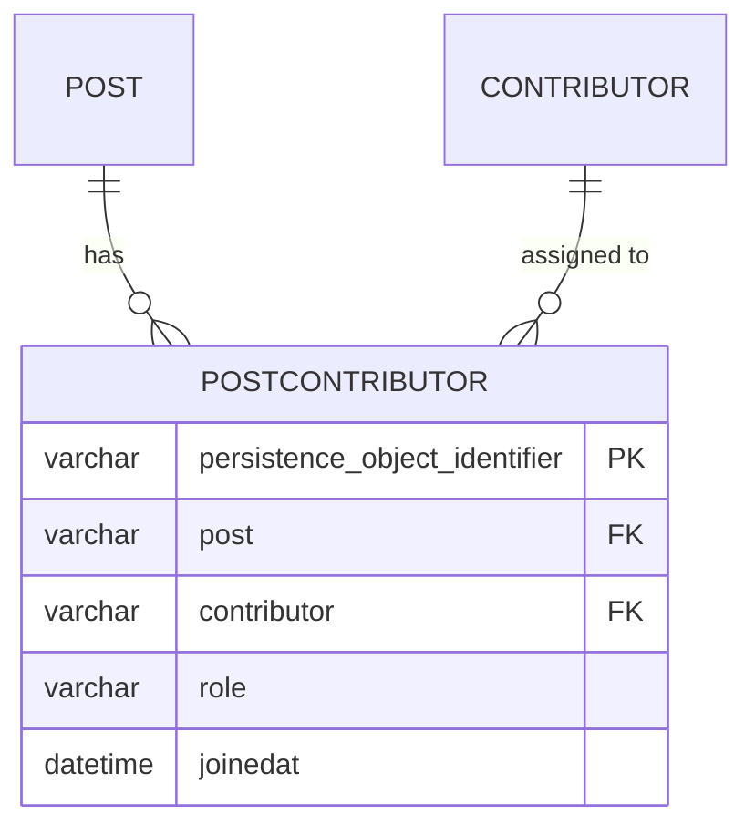

# 06 — ManyToMany có thuộc tính phụ (Post ↔ Contributor kèm role, joinedAt)

## Mục tiêu

Khi quan hệ N-N cần lưu thêm dữ liệu về CHÍNH mối quan hệ (không thuộc về
bên nào), Doctrine không hỗ trợ `#[ORM\ManyToMany]` với cột phụ trên join
table — phải tách thành **entity trung gian** với hai `ManyToOne`.

## Lý thuyết



Đây thực chất là **hai quan hệ OneToMany/ManyToOne** ghép lại, KHÔNG phải
ManyToMany thật với Doctrine — `PostContributor` là một entity đầy đủ, có
identity riêng (`persistence_object_identifier`), không phải một row join
table trần trụi.

Schema thật (đã generate + migrate):

| Bảng | Cột | Ghi chú |
|---|---|---|
| `lesson06_post` | PK, `title` | |
| `lesson06_contributor` | PK, `name` | |
| `lesson06_post_contributor` | PK riêng, `post` (FK), `contributor` (FK), `role`, `joinedat` | Có PK riêng — khác join table thuần ở bài 05 (không có PK kép trên 2 FK) |

## Owning side vs Inverse side

`PostContributor` là owning side của CẢ HAI quan hệ (`ManyToOne` tới `Post`
và `ManyToOne` tới `Contributor`). `Post::$contributorAssignments` và
`Contributor::$postAssignments` đều chỉ là inverse side (đọc, không quyết
định SQL). Quên đồng bộ: tạo `new PostContributor($post, $contributor,
'editor')` mà quên add vào `$post->contributorAssignments` → lần gọi
`$post->getContributorAssignments()` tiếp theo trong CÙNG request sẽ không
thấy assignment vừa tạo (dù DB sẽ đúng sau khi flush, vì `PostContributor` tự
nó đã trỏ đúng `$post`).

## Cách Flow làm khác Laravel/Eloquent

Laravel dùng pivot table với `withPivot(['role', 'joined_at'])` — cột phụ vẫn
nằm TRONG join table, không có Model riêng (trừ khi bạn tự định nghĩa Pivot
Model). Flow/Doctrine buộc bạn nghĩ `PostContributor` như một **entity thật
sự có nghĩa nghiệp vụ** (một "lượt tham gia"), không phải chi tiết kỹ thuật
của quan hệ — đây là khác biệt về TƯ DUY, không chỉ cú pháp: bạn có thể query
`PostContributorRepository` (nếu có) để hỏi "ai làm editor sau ngày X" một
cách tự nhiên, thứ khó làm gọn với pivot table thuần.

## Ví dụ chạy được

```php
// PostContributor.php — owning cả 2 chiều
#[ORM\ManyToOne(targetEntity: Post::class, inversedBy: 'contributorAssignments')]
#[ORM\JoinColumn(name: 'post', referencedColumnName: 'persistence_object_identifier', nullable: false)]
protected Post $post;

#[ORM\ManyToOne(targetEntity: Contributor::class, inversedBy: 'postAssignments')]
#[ORM\JoinColumn(name: 'contributor', referencedColumnName: 'persistence_object_identifier', nullable: false)]
protected Contributor $contributor;

#[ORM\Column(type: 'string', length: 40)]
protected string $role;

#[ORM\Column(type: 'datetime')]
protected \DateTime $joinedAt;
```

`PostContributor` KHÔNG có Repository riêng trong package này (giống
`Comment` bài 03) — quản lý hoàn toàn qua `Post::addContributor()`.

## Bẫy thường gặp

1. Cố dùng `#[ORM\ManyToMany]` với cột phụ trực tiếp trên property — Doctrine
   không hỗ trợ, phải tách entity trung gian.
2. Quên thêm assignment vào cả 2 collection (`Post` và `Contributor`) khi tạo
   `PostContributor` bằng tay (ngoài `addContributor()`).
3. Đặt `role`/`joinedAt` là nullable trong khi nghiệp vụ yêu cầu luôn có — dễ
   quên set khi tạo assignment không qua factory method.
4. Không có unique constraint (post, contributor, role) → có thể tạo trùng
   assignment cùng role cho cùng cặp Post/Contributor nếu không tự kiểm tra
   trong code.

## Bài tập

- **Cơ bản**: điền TODO cho 2 `ManyToOne` trong `PostContributor`, và 2
  `OneToMany` inverse trong `Post`/`Contributor`.
- **Nâng cao**: implement `Post::addContributor(Contributor $contributor,
  string $role): PostContributor` — tạo `PostContributor`, add vào
  `$contributorAssignments`, idempotent theo cặp (contributor, role).
- **Thử thách**: thêm method `Contributor::getRoleOnPost(Post $post):
  ?string` KHÔNG dùng DQL/QueryBuilder — chỉ duyệt `$postAssignments` trong
  PHP. Sau đó viết lại bằng DQL (bài 10 sẽ dạy kỹ hơn) và so sánh: cách nào
  gây N+1 nếu gọi cho nhiều Contributor?

## Cách tự kiểm tra

```bash
./flow doctrine:validate
./flow doctrine:migrationgenerate && ./flow doctrine:migrate
```
```sql
SELECT c.name, p.title, pc.role, pc.joinedat
FROM lesson06_post_contributor pc
JOIN lesson06_post p ON p.persistence_object_identifier = pc.post
JOIN lesson06_contributor c ON c.persistence_object_identifier = pc.contributor;
```

## Quiz

1. Vì sao Doctrine không cho gắn cột phụ trực tiếp lên `#[ORM\ManyToMany]`?
   Điều gì về bản chất join table thuần khiến việc này không hợp lý?
2. `PostContributor` có `persistence_object_identifier` riêng — điều này
   khác gì so với PK kép (`post`, `tag`) của join table ở bài 05?
3. Nếu nghiệp vụ yêu cầu một Contributor có thể có NHIỀU role trên cùng một
   Post (ví dụ vừa "editor" vừa "reviewer"), thiết kế hiện tại có hỗ trợ
   được không? Cần đổi gì?

Đáp án: `solutions/06-many-to-many-with-attributes.md`.
