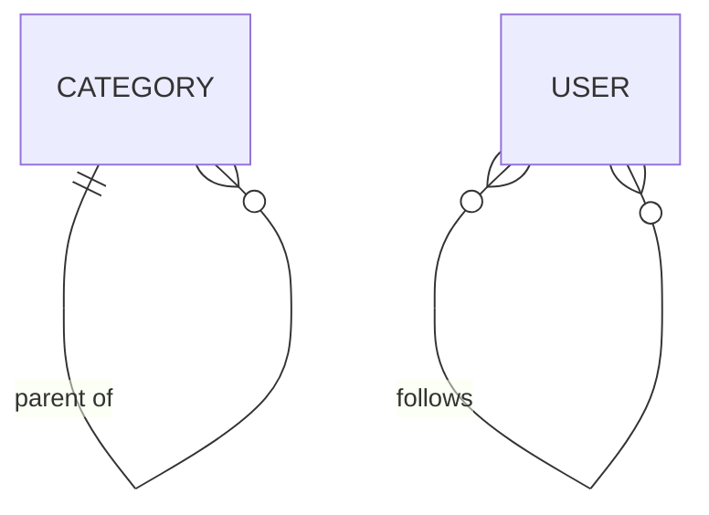

# 07 — Self-referencing (Category cây, User follow User)

## Mục tiêu

Mapping quan hệ mà entity tự tham chiếu tới chính class của nó: cây phân cấp
(`Category` parent/children) và ManyToMany tự tham chiếu (`User` follow
`User`) — cả hai đòi hỏi xử lý đặc biệt so với các bài trước.

## Lý thuyết



Schema thật (đã generate + migrate):

| Bảng | Cột | Ghi chú |
|---|---|---|
| `lesson07_category` | PK, `parent` (FK, NULLABLE, → chính bảng này), `name` | Adjacency list — mỗi row biết cha trực tiếp, không biết toàn bộ path |
| `lesson07_user` | PK, `handle` (UNIQUE) | |
| `lesson07_user_follows` | `follower` (FK), `followee` (FK), PK kép (follower, followee) | Join table self-referencing — 2 cột PHẢI có tên khác nhau |

## Owning side vs Inverse side

- **Category**: `$parent` (ManyToOne, owning) ↔ `$children` (OneToMany,
  inverse, `mappedBy: 'parent'`).
- **User follow**: `$following` (ManyToMany, owning) ↔ `$followers`
  (ManyToMany, inverse, `mappedBy: 'following'`).

## Bẫy đã gặp thật khi làm bài này (rất đáng đọc)

Lần đầu viết `User::$following`, tôi khai báo:

```php
#[ORM\ManyToMany(targetEntity: User::class, inversedBy: 'followers')]
#[ORM\JoinTable(name: 'lesson07_user_follows')]
#[ORM\JoinColumn(name: 'follower', ...)]      // SAI VỊ TRÍ
#[ORM\InverseJoinColumn(name: 'followee', ...)] // SAI VỊ TRÍ
protected Collection $following;
```

`doctrine:migrationgenerate` sinh ra:

```sql
CREATE TABLE lesson07_user_follows (
    doctrinelab_lesson07_user VARCHAR(40) NOT NULL,
    PRIMARY KEY(doctrinelab_lesson07_user)
)
```

**Chỉ một cột** — sai hoàn toàn (join table N-N cần 2 cột). Đọc source
`FlowAnnotationDriver::evaluateJoinTableAnnotation()` mới rõ nguyên nhân:
với `ManyToMany`, Flow **chỉ đọc `joinColumns`/`inverseJoinColumns` lồng bên
trong `#[ORM\JoinTable(...)]`**, không đọc `#[ORM\JoinColumn]` đặt rời trên
property (cách đó chỉ hợp lệ cho `ManyToOne`/`OneToOne`). Vì cả hai chiều
join đều trỏ tới CÙNG class `User`, tên cột tự sinh bị trùng nhau → Doctrine
chỉ tạo được 1 cột. Sửa đúng:

```php
#[ORM\ManyToMany(targetEntity: User::class, inversedBy: 'followers')]
#[ORM\JoinTable(
    name: 'lesson07_user_follows',
    joinColumns: [new ORM\JoinColumn(name: 'follower', referencedColumnName: 'persistence_object_identifier')],
    inverseJoinColumns: [new ORM\JoinColumn(name: 'followee', referencedColumnName: 'persistence_object_identifier')]
)]
protected Collection $following;
```

Sau khi sửa, SQL sinh ra đúng 2 cột `follower`/`followee` với 2 FK riêng —
đã migrate thật và kiểm tra `SHOW CREATE TABLE`.

**Bài học**: self-referencing ManyToMany LUÔN cần khai tên cột join tường
minh — không thể dựa vào tên tự sinh của Doctrine vì cả 2 phía trỏ cùng
class.

## Cách Flow làm khác Laravel/Eloquent

Cây phân cấp trong Laravel thường dùng package ngoài (`kalnoy/nestedset`)
hoặc tự viết. Flow/Doctrine hỗ trợ self-referencing ManyToOne/OneToMany trực
tiếp bằng cú pháp thông thường (`targetEntity: self::class` chính là class
đang khai báo) — không cần thư viện thêm cho adjacency list cơ bản.

**Điểm khác biệt quan trọng hơn**: `Category` có Repository riêng (là
aggregate root), NHƯNG target của quan hệ `children` cũng chính là
`Category` → cũng là aggregate root. Theo quy tắc ở bài 03/08,
`isAggregateRoot() === true` nghĩa là Flow **không** tự cascade. Đã kiểm
chứng thật:

```
lesson07_category row count after persisting only root: 3
```

Kết quả này CHỈ đúng vì tôi khai báo tường minh
`#[ORM\OneToMany(..., cascade: ['persist'])]` trên `$children`. Nếu bỏ
`cascade: ['persist']`, `persistAll()` sẽ throw
`InvalidArgumentException` "A new entity was found... cascade persist".

## Ví dụ chạy được

```php
// Category.php
#[ORM\ManyToOne(targetEntity: Category::class, inversedBy: 'children')]
#[ORM\JoinColumn(name: 'parent', referencedColumnName: 'persistence_object_identifier', nullable: true)]
protected ?Category $parent = null;

#[ORM\OneToMany(mappedBy: 'parent', targetEntity: Category::class, cascade: ['persist'])]
protected Collection $children;
```

## Bẫy thường gặp

1. ManyToMany self-referencing không đặt tên cột join tường minh (xem trên).
2. Quên `cascade: ['persist']` trên self-referencing OneToMany khi target
   cũng là aggregate root → lỗi persist khi cố lưu cả cây từ root.
3. `User::follow($this)` (tự follow chính mình) không được chặn trong code →
   phải tự kiểm tra `$user === $this`.
4. Cây quá sâu + load bằng adjacency list → N truy vấn để lấy path đầy đủ
   (N+1 theo độ sâu) — bài 10 sẽ chỉ cách dùng fetch join hoặc CTE để giảm.
5. Xóa một `Category` cha còn con → vi phạm FK (đã thấy: FK `parent` không
   có `onDelete`, MySQL sẽ chặn xóa cha còn con, đúng ý muốn ở đây).

## Bài tập

- **Cơ bản**: điền TODO cho `$parent` (ManyToOne) và `$children` (OneToMany).
  Tự quyết định có cần `cascade` không — kiểm chứng bằng cách persist root
  rồi query `SELECT COUNT(*) FROM lesson07_category`.
- **Nâng cao**: implement `follow()`/`unfollow()` trên `User`, chặn tự
  follow, đồng bộ 2 phía, idempotent. Khai đúng `JoinTable` với tên cột
  tường minh.
- **Thử thách**: viết `Category::getDepth(): int` (số cấp từ root) chỉ bằng
  cách duyệt `$parent` trong PHP (không DQL). Sau đó nghĩ: nếu cây có 1000
  cấp, cách này tốn bao nhiêu query? Đề xuất 1 cách khác (gợi ý: fetch join
  nhiều cấp, hoặc lưu thêm cột `path`/`depth` — không cần code, chỉ cần giải
  thích trong quiz).

## Cách tự kiểm tra

```bash
./flow doctrine:validate
./flow doctrine:migrationgenerate && ./flow doctrine:migrate
```
```sql
SHOW CREATE TABLE lesson07_user_follows;
-- phải thấy 2 cột (follower, followee), 2 FOREIGN KEY, PRIMARY KEY(follower, followee)
```

## Quiz

1. Vì sao self-referencing ManyToMany bắt buộc khai `joinColumns`/
   `inverseJoinColumns` tường minh, còn ManyToMany bình thường (bài 05)
   không cần?
2. Vì sao `Category::$children` cần `cascade: ['persist']` tường minh, còn
   `Post::$comments` ở bài 03 không cần khai gì mà vẫn cascade?
3. Điều gì xảy ra nếu bạn xóa `CategoryRepository`? Cascade mặc định của
   Flow có thay đổi không, theo hướng nào?

Đáp án: `solutions/07-self-referencing.md`.
