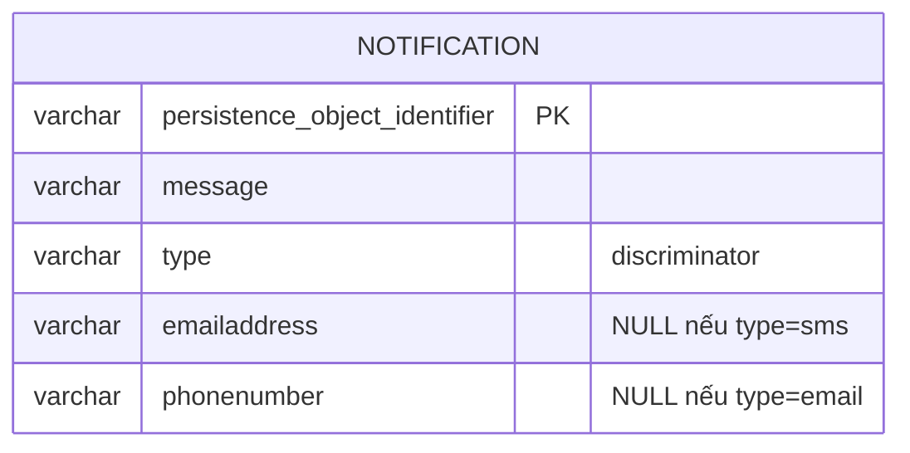
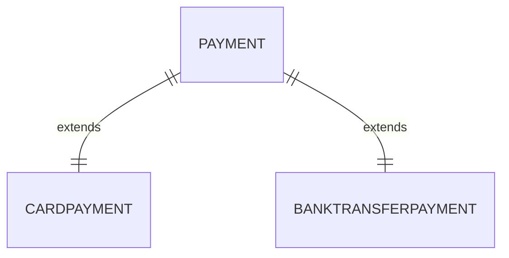

# 09 — Inheritance mapping & Value Object/Embeddable

## Mục tiêu

Mapping kế thừa PHP thành bảng DB theo 2 chiến lược (Single Table, Joined
Table), và dùng `#[Flow\ValueObject]` để embed dữ liệu bất biến vào entity
mà không tạo bảng riêng.

## Lý thuyết

### Single Table Inheritance — `Notification`



**Một bảng duy nhất** cho cả `Notification`, `EmailNotification`,
`SmsNotification`. Schema thật (đã generate):

```sql
CREATE TABLE lesson09_notification (
    persistence_object_identifier VARCHAR(40) NOT NULL,
    message VARCHAR(255) NOT NULL,
    type VARCHAR(20) NOT NULL,           -- discriminator column
    emailaddress VARCHAR(255) DEFAULT NULL,  -- cột riêng của EmailNotification, NULL khi type=sms
    phonenumber VARCHAR(20) DEFAULT NULL,    -- cột riêng của SmsNotification, NULL khi type=email
    PRIMARY KEY(persistence_object_identifier)
)
```

Ưu điểm: query toàn bộ Notification không cần JOIN. Nhược điểm: nhiều cột
NULL khi số subclass tăng, không ép được NOT NULL cho cột riêng của subclass
ở tầng DB.

### Joined Table Inheritance — `Payment`



**Một bảng cho lớp cha + một bảng riêng cho mỗi subclass**, nối bằng chính
`persistence_object_identifier`. Schema thật (đã generate + migrate):

```sql
CREATE TABLE lesson09_payment (persistence_object_identifier VARCHAR(40) NOT NULL, amountincents INT NOT NULL, type VARCHAR(20) NOT NULL, PRIMARY KEY(...))
CREATE TABLE lesson09_card_payment (persistence_object_identifier VARCHAR(40) NOT NULL, lastfourdigits VARCHAR(4) NOT NULL, PRIMARY KEY(...))
CREATE TABLE lesson09_bank_transfer_payment (persistence_object_identifier VARCHAR(40) NOT NULL, iban VARCHAR(34) NOT NULL, PRIMARY KEY(...))

ALTER TABLE lesson09_card_payment ADD CONSTRAINT ...
    FOREIGN KEY (persistence_object_identifier) REFERENCES lesson09_payment (persistence_object_identifier) ON DELETE CASCADE
```

Chú ý: FK của bảng con trỏ THẲNG vào PK của bảng cha, và Doctrine tự thêm
`ON DELETE CASCADE` cho quan hệ này (xóa Payment cha thì bảng con cũng mất
hàng tương ứng — hợp lý vì chúng là CÙNG MỘT object, chỉ tách cột).

### Value Object embedded — `Address` trong `Customer`

```php
#[Flow\ValueObject]   // embedded=true là default
class Address { /* street, zipCode, city */ }

class Customer {
    protected Address $address;   // KHÔNG cần attribute ORM nào cả
}
```

Schema thật:
```sql
CREATE TABLE lesson09_customer (
    persistence_object_identifier VARCHAR(40) NOT NULL,
    name VARCHAR(120) NOT NULL,
    addressstreet VARCHAR(255) NOT NULL,
    addresszipcode VARCHAR(20) NOT NULL,
    addresscity VARCHAR(120) NOT NULL,
    PRIMARY KEY(...)
)
```

Không có bảng `address` riêng — cột được "làm phẳng" vào `lesson09_customer`
với tiền tố tên property (`address` + tên field).

## Owning side vs Inverse side

Không áp dụng cho inheritance (không phải quan hệ). Với Value Object embedded,
không có "owning/inverse" vì Address không có identity riêng — nó chỉ là dữ
liệu của Customer.

## Cách Flow làm khác Laravel/Eloquent

Laravel không có inheritance mapping tích hợp (thường dùng Single Table giả
lập bằng `casts`/accessor tự viết, hoặc package ngoài). Với Value Object,
Laravel dùng Eloquent "Casts" (`AsAddress::class`) — tương tự về HIỆU QUẢ
nhưng khác về TƯ DUY: Flow's ValueObject là một **class DDD thật** (immutable,
so sánh bằng giá trị), không phải một cast kỹ thuật.

**Sự thật quan trọng đã đọc từ source** (`Neos.Flow/Classes/Annotations/
ValueObject.php`): `#[Flow\ValueObject]` có `embedded = true` là **mặc
định**. Nếu bạn viết `#[Flow\ValueObject(embedded: false)]`, Flow chuyển
sang chế độ hoàn toàn khác: Value Object đó có bảng VÀ identity riêng, và
Flow **dedup tự động** — hai object Value Object giống nhau về giá trị sẽ
tái sử dụng CÙNG MỘT row trong DB (đọc từ docblock gốc: "Flow applies some
optimizations internally, e.g. to store only one instance of the value
object"). Bài này chỉ dùng `embedded: true` (mặc định).

## Ví dụ chạy được

Toàn bộ SQL ở trên đã generate + migrate thật trong môi trường này (tổng 5
bảng cho bài 9: `lesson09_notification`, `lesson09_payment`,
`lesson09_card_payment`, `lesson09_bank_transfer_payment`,
`lesson09_customer`).

## Bẫy thường gặp

1. Thêm `#[ORM\Table]` trên subclass của Single Table Inheritance — SAI, chỉ
   lớp cha có Table; subclass dùng chung bảng.
2. Quên `#[Flow\ValueObject]` trên `Address` → Flow không biết property
   `Customer::$address` là gì, báo lỗi mapping rõ ràng đòi bạn khai
   `@OneToOne/@ManyToOne/...` (giống lỗi đã thấy ở bài 02 khi thiếu quan hệ).
3. Nhầm Joined Table với ManyToOne/OneToOne thông thường — Joined Table
   dùng CHUNG `persistence_object_identifier`, không có cột FK riêng biệt
   với tên khác.
4. Value Object có setter (mutable) — phá vỡ nguyên tắc DDD, và nếu dùng
   `embedded: false` sẽ phá cả cơ chế dedup của Flow (hai giá trị giống nhau
   nhưng khác object reference có thể tạo 2 row thay vì tái dùng 1).
5. Chọn Single Table cho hierarchy có QUÁ NHIỀU cột khác biệt giữa các
   subclass → bảng đầy cột NULL, khó đọc, khó thêm NOT NULL constraint đúng.

## Bài tập

- **Cơ bản**: thêm `#[ORM\InheritanceType('SINGLE_TABLE')]` +
  `DiscriminatorColumn` + `DiscriminatorMap` vào `Notification`; tương tự
  `JOINED` cho `Payment`; thêm `#[Flow\ValueObject]` vào `Address`.
- **Nâng cao**: thêm subclass thứ 3 cho `Payment` (ví dụ `CashPayment`, chỉ
  có `amountInCents`, không có cột riêng) — quan sát bảng `lesson09_cash_payment`
  sinh ra chỉ có PK, không có cột nghiệp vụ nào khác ngoài của cha.
- **Thử thách**: đổi `Notification` (đang Single Table) sang Joined Table
  và ngược lại `Payment` sang Single Table. Generate migration cho cả hai
  chiều đổi, so sánh SQL sinh ra và giải thích khi nào nên chọn chiến lược
  nào cho một hierarchy có nhiều subclass với ít cột riêng vs ít subclass
  với nhiều cột riêng.

## Cách tự kiểm tra

```bash
./flow doctrine:validate
./flow doctrine:migrationgenerate && ./flow doctrine:migrate
```
```sql
SHOW CREATE TABLE lesson09_notification;   -- 1 bảng, có cột "type"
SHOW CREATE TABLE lesson09_card_payment;   -- FK tới lesson09_payment, ON DELETE CASCADE
SHOW CREATE TABLE lesson09_customer;       -- có addressstreet/addresszipcode/addresscity, KHÔNG có bảng address riêng
```

## Quiz

1. Vì sao Joined Table Inheritance tự động có `ON DELETE CASCADE` giữa bảng
   con và bảng cha, còn quan hệ ManyToOne bình thường (bài 02) thì không?
2. Nếu `Address` dùng `embedded: false` thay vì mặc định, điều gì thay đổi
   về schema DB và về hành vi khi 2 Customer có địa chỉ giống nhau?
3. Cho một tiêu chí cụ thể để chọn Single Table thay vì Joined Table (không
   phải "khi đơn giản hơn" — nói về số subclass, số cột riêng, tần suất
   query toàn bộ hierarchy).

Đáp án: `solutions/09-inheritance-and-value-objects.md`.
